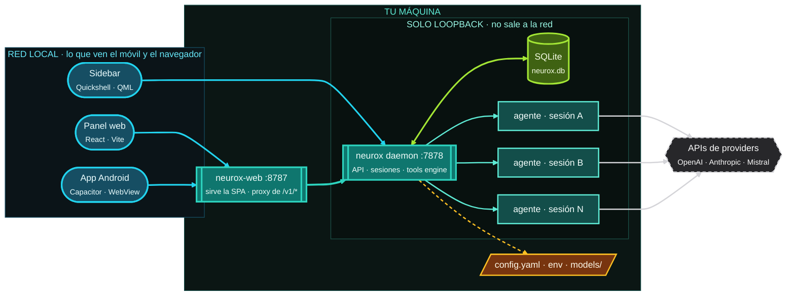

# neurox

> Orquestador local de agentes de IA. Un daemon en Rust como núcleo único, con
> tres clientes que hablan el mismo protocolo.

**neurox** es un servicio local que administra proveedores de LLM, sesiones de
chat, agentes, herramientas y el streaming de las respuestas. Toda la lógica de
estado vive en el daemon; los clientes son *thin clients* que consumen la misma
API y comparten los mismos datos.

## Arquitectura



Dos detalles que explican por qué está montado así:

- **El daemon no se expone.** Escucha en `127.0.0.1` y solo `neurox-web` lo
  alcanza, haciendo de proxy. Quien accede a la red ve el panel, nunca el
  daemon. Por eso el bundle del panel se construye con la API en *same-origin*.
- **Un subproceso por sesión.** Cada sesión de chat obtiene su propio proceso
  `agent`, con memoria de trabajo aislada. Una sesión ocupada o caída nunca
  bloquea a otra.

### Un mensaje de ida y vuelta

```mermaid
%%{init: {"theme":"base","themeVariables":{
  "background":"#0a0e14",
  "actorBkg":"#164e63","actorBorder":"#22d3ee","actorTextColor":"#ecfeff",
  "actorLineColor":"#334155","actorFontWeight":"600",
  "signalColor":"#7dd3fc","signalTextColor":"#e2e8f0",
  "labelBoxBkgColor":"#0f172a","labelBoxBorderColor":"#1e293b","labelTextColor":"#e2e8f0",
  "activationBkgColor":"#0f766e","activationBorderColor":"#2dd4bf",
  "noteBkgColor":"#422006","noteTextColor":"#fde68a","noteBorderColor":"#fbbf24",
  "sequenceNumberColor":"#94a3b8",
  "fontFamily":"ui-sans-serif,system-ui,sans-serif","fontSize":"14px"
}}}%%
sequenceDiagram
  autonumber
  actor U as Usuario
  participant C as Cliente
  participant P as neurox-web
  participant D as daemon
  participant A as agente

  rect rgb(10, 20, 38)
    U->>C: escribe y envía
    activate C
    C->>P: POST /v1/sessions/:id/messages/stream
    activate P
    P->>D: proxy de /v1/* con el JWT
    activate D
    D->>A: JSON-RPC por stdio
    activate A
    A-->>D: tokens del LLM
    D-->>C: SSE, token a token
    deactivate A
    deactivate D
    deactivate P
    C-->>U: texto en vivo
  end

  Note over C,D: los eventos en vivo llegan por otro canal,<br/>WebSocket a /v1/events

  rect rgb(6, 32, 30)
    A->>D: el agente pide una tool
    alt la tool requiere aprobación
      D-->>C: evento tool_call
      C-->>U: la tool pide permiso
      U->>C: aprueba o rechaza
      C->>D: POST /v1/approvals/:id/respond
      D->>A: continúa con el resultado
    else la tool se ejecuta sola
      D->>A: continúa sin intervención
    end
  end
```



Las barras turquesa sobre cada participante marcan quién está procesando en cada
momento. La parte de abajo no siempre ocurre: solo cuando la tool pide permiso.

## Qué hace

| Área | Detalle |
|------|---------|
| **Chat** | Streaming token a token, historial por sesión, reanudar, renombrar |
| **Agentes** | Plantillas versionadas (identidad, prompt, skills), arranque y parada |
| **Proveedores LLM** | Catálogo, test, ping, modelo por sesión, preferencia por usuario |
| **Modelos** | Catálogo agregado, modelos locales (GGUF), descarga desde Hugging Face |
| **Tools** | Listado, ejecutar, habilitar y deshabilitar; algunas piden aprobación |
| **Aprobaciones** | Cola human-in-the-loop para tool calls que lo requieren |
| **Skills** | Listado y activación por nombre |
| **Entorno** | Catálogo de variables de entorno, lectura y escritura en runtime |
| **Multiusuario** | JWT con roles `Admin` / `Operator` / `Viewer` |

## Componentes

| Componente | Ruta | Stack | Rol |
|-----------|------|-------|-----|
| **daemon** | [`daemon/`](./daemon) | Rust · axum, tokio | Núcleo: API, sesiones, proveedores, tools engine |
| **agent** | [`daemon/agents/`](./daemon/agents) | Rust | Proceso del agente: identidad, memoria, skills, backend LLM |
| **client/web** | [`client/web/`](./client/web) | React + Vite + TypeScript | Panel: chat, modelos, providers, configuración |
| **client/app** | [`client/app/`](./client/app) | Capacitor + Kotlin | App Android que envuelve el panel |
| **agents/** | [`agents/`](./agents) | JSON + Markdown | Plantillas versionadas de agentes |
| **.sdd** | [`.sdd/`](./.sdd) | Markdown | Source of truth: gobernanza, ADRs, glosario |

El **sidebar de escritorio** (Quickshell/QML) es un cliente más, pero vive en tu
repo de dotfiles, no aquí.

## Requisitos

Rust estable, Node 18+ y las API keys de los proveedores que quieras usar.

## Puesta en marcha

### 1. Compilar el daemon

```bash
cd daemon
cargo build --release -p neurox --bin neurox
install -Dm755 target/release/neurox ~/.local/bin/neurox
```

### 2. Configurar las keys

Las keys **no viven en el repositorio**. Se cargan desde un archivo de entorno
privado con permisos `0600`:

```bash
mkdir -p ~/.config/neurox
cat > ~/.config/neurox/env <<'EOF'
OPENROUTER_API_KEY=...
MISTRAL_API_KEY=...
OPENCODE_API_KEY=...
EOF
chmod 600 ~/.config/neurox/env
```

La configuración del daemon es [`daemon/config.example.yaml`](./daemon/config.example.yaml).

### 3. Arrancar

```bash
systemctl --user enable --now neurox.service
curl -s http://127.0.0.1:7878/health    # → {"status":"ok", ...}
```

### 4. Panel web

En desarrollo, con recarga en caliente:

```bash
cd client/web
npm install
npm run dev                              # http://localhost:5173
```

En producción, `neurox-web` sirve el build y proxea la API:

```bash
cd client/web && npm run build
systemctl --user enable --now neurox-web.service   # http://<tu-ip>:8787
```

### 5. App Android

```bash
cd client/app
npm install
npx cap sync android
cd android && ./gradlew assembleDebug
```

## API

El daemon expone HTTP en `127.0.0.1:7878`. Usa **dos transportes**, no uno:

- **SSE** para el streaming del chat (`/v1/sessions/:id/messages/stream`).
- **WebSocket** para eventos y comandos (`/v1/events`, `/v1/commands`). El JWT
  viaja en el query string (`?token=…`) porque el navegador no puede mandar
  headers en un upgrade de WebSocket.

Resumen por área:

| Área | Rutas |
|------|-------|
| Salud | `/health` · `/livez` · `/readyz` |
| Auth | `/v1/auth/login` · `/refresh` · `/logout` · `/v1/users/me/password` |
| Sesiones | `/v1/sessions` · `/:id/messages` · `/messages/stream` · `/cancel` · `/end` · `/rename` · `/model` · `/mode` · `/temperature` · `/tool-mode` |
| Agentes | `/v1/agents` · `/:id/start` · `/:id/stop` |
| Aprobaciones | `/v1/approvals` · `/v1/approvals/:id/respond` |
| Tools y skills | `/v1/tools` · `/:name/invoke` · `/:name/enable` · `/:name/disable` · `/v1/skills` |
| LLM | `/v1/llm/providers` · `/prefs` · `/models` · `/models/local` · `/models/hf` · `/models/download` |
| Entorno | `/v1/env` · `/v1/env/:key` |
| Otros | `/v1/services` · `/v1/sandbox` · `/v1/default/status` · `/v1/chat/raw` |

## Documentación

- [Arquitectura](./docs/architecture.md)
- [Source of truth](./.sdd/README.md) — gobernanza, ADRs, glosario
- [Glosario canónico](./.sdd/GLOSSARY.md)
- [Contribuir](./CONTRIBUTING.md)

## Licencia

Propietaria y de uso privado. Ver [`LICENSE`](./LICENSE).